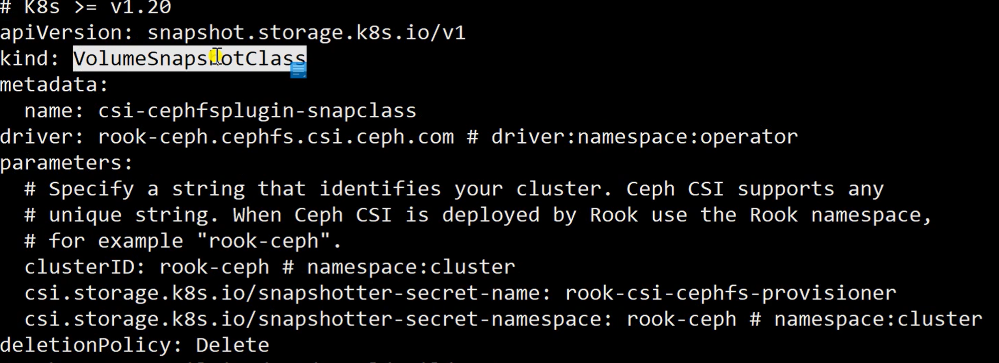

# kubernetes笔记

## 目录

- **第1章**：K8s全栈架构师课程介绍
- **第2章**：K8s全栈架构师课程前期准备及知识扫盲
- **第3章**：Kubeadm高可用安装k8s集群
- **第4章**：二进制高可用安装k8s集群-生产级
- **第5章**：K8s基础篇-必备容器基础
- **第6章**：K8s基础篇-基本概念
- **第7章**：K8s基础篇-资源调度
- **第8章**：K8s基础篇-服务发布入门
- **第9章**：K8s基础篇-配置管理
- **第10章**：K8s进阶篇-持久化存储入门
- **第11章**：K8s进阶篇-高级调度计划任务、污点和容忍、Affinity
- **第12章**：Kubernetes进阶-高级调度准入控制
- **第13章**：K8s进阶篇-细粒度权限控制
- **第14章**：K8s高级篇-云原生存储及存储进阶
- **第15章**：K8s高级篇-中间件容器化及Helm
- **第16章**：K8s运维篇-K8s容器日志收集
- **第17章**：K8s运维篇-Prometheus监控入门
- **第18章**：K8s运维篇-Prometheus实践
- **第19章**：K8s运维篇-Alertmanager告警实战
- **第20章**：K8s运维篇-服务发布Ingress进阶
- **第21章**：DevOps篇-持续集成/持续部署入门
- **第22章**：DevOps篇-DevOps进阶
- **第23章**：DevOps篇-DevOps实践
- **第24章**：DevOps篇-SpringCloud容器化原理及生产建议
- **第25章**：知识扩展篇-Istio-为什么会出现服务网格
- **第26章**：知识拓展篇-服务网格Istio基础篇
- **第27章**：知识拓展篇-服务网格Istio安装篇
- **第28章**：知识拓展篇-服务网格Istio流量管理实践
- **第29章**：Kubernetes知识拓展-网络策略
- **第30章**：Kubernetes知识拓展-K8s集群升级
- **第31章**：Kubernetes知识拓展-Bootstrapping原理

### 第1章：K8s全栈架构师课程介绍

- 1-1 了解本课程高薪K8s课程介绍
- 1-2 为什么要学K8s？
- 1-3 为什么一直学不好K8s？K8s学不会的原因
- 1-4 K8s架构师课程主要内容介绍

### 第2章：K8s全栈架构师课程前期准备及知识扫盲

- 2-1 课程资料获取方式
- 2-2 课程免费更新注意事项
- 2-3 Kubeadm一次性安装即成功原则
- 2-4 二进制一次性安装即成功原则
- 2-6 服务器配置选型原则
- 2-7 生产环境K8s版本选择及安装注意事项
- 2-10 CentOS7系统安装
- 2-11 虚拟机拍快照技巧

### 第3章：K8s安装篇-Kubeadm高可用安装k8s集群

- 3-1 Kubeadm及二进制安装高可用集群注意事项
- 3-2 K8s节点系统优化及内核升级
- 3-3 K8s高可用组件安装
- 3-4 K8s Runtime及K8s核心组件安装
- 3-5 K8s 集群Master节点初始化
- 3-6 K8s初始化失败常见问题
- 3-7 K8s添加Master实现高可用
- 3-8 K8s添加节点Token过期处理
- 3-9 K8s添加工作节点
- 3-10 K8s CNI网络插件Calico安装
- 3-11 K8s度量指标组件Metrics安装
- 3-12 K8s图形化页面安装
- 3-14 Kubeadm关键配置及注意事项
- 3-16 Kubectl命令详解
- 3-17 K8s 集群证书更新
- 3-18 K8s 集群证书更新至100年

### 第4章：K8s安装篇-二进制高可用安装k8s集群-生产级

- 4-1 K8s二进制高可用安装注意事项
- 4-2 K8s节点系统优化及内核升级
- 4-3 K8s Runtime及核心组件安装
- 4-4 K8s制作集群组件100年证书
- 4-5 K8s高可用组件安装配置
- 4-6 K8s Etcd高可用集群部署
- 4-7 K8s核心组件高可用安装
- 4-8 K8s自动颁发证书Bootstrapping配置
- 4-9 K8s工作节点配置
- 4-10 K8s CNI插件Calico及CoreDNS安装
- 4-11 K8s图形化界面和度量指标Metrics安装
- 4-13 生产高可用集群可用性验证
- 4-14 Kubectl命令详解

### 第5章：K8s基础篇-必备容器基础

- 5-1 互联网架构发展趋势
- 5-2 什么是容器
- 5-3 Docker已失宠，为什么还要用它
- 5-4 什么是Docker
- 5-5 Docker安装注意事项
- 5-6 Docker基本命令-Docker Version
- 5-7 Docker基本命令-Docker Info
- 5-8 Docker基本命令-镜像操作
- 5-9 Docker基本命令-容器操作
- 5-10 Docker基本命令-数据持久化
- 5-11 Dockerfile-常用指令介绍
- 5-12 Dockerfile-RUN和WORKDIR
- 5-13 CMD和ENTRYPOINT
- 5-14 CMD和ENTRYPOINT区别
- 5-15 Dockerfile-ADD和COPY
- 5-16 动态Dockerfile传参
- 5-17 镜像优化-选择合适的基础镜像
- 5-18 镜像优化-多阶段构建
- 5-19 Docker基础测试

### 第6章：K8s基础篇-基本概念

- 6-1 为什么要用K8s
- 6-2 K8s架构剖析
- 6-3 控制节点组件介绍
- 6-4 Scheduler和Controller是有状态组件
- 6-5 工作节点组件介绍
- 6-6 什么是Pod
- 6-7 为什么要引入Pod
- 6-8 定义一个Pod
- 6-9 修改容器的启动命令
- 6-10 Pod状态及问题排查方法
- 6-11 Pod镜像拉取策略
- 6-12 Pod重启策略
- 6-13 零宕机服务发布-探针
- 6-14 探针的四种探测方式
- 6-15 零宕机服务发布-Liveness和Readiness
- 6-16 零宕机服务发布-startupProbe
- 6-17 零宕机服务发布-Pod启动过程
- 6-18 零宕机服务发布-Pod平滑退出
- 6-19 零宕机服务发布-Prestop和postStart
- 6-20 新版本功能-gRPC健康检查

### 第7章：K8s基础篇-资源调度

- 7-1 ReplicaSet和Replication Controller
- 7-2 什么是无状态调度Deployment
- 7-3 创建Deployment
- 7-4 Deployment滚动更新
- 7-5 Deployment回滚
- 7-6 Deployment扩容和缩容
- 7-7 Deployment暂停和恢复
- 7-8 Deployment更新策略及注意事项
- 7-9 什么是有状态调度StatefulSet
- 7-10 什么是Headless Service
- 7-11 创建一个StatefulSet
- 7-12 StatefulSet创建和删除Pod的过程
- 7-13 Headless Service通信原理
- 7-14 StatefulSet扩容和缩容
- 7-15 StatefulSet更新策略
- 7-16 StatefulSet灰度发布
- 7-17 StatefulSet级联和非级联删除
- 7-18 什么是守护进程DaemonSet
- 7-19 创建一个DaemonSet
- 7-20 选择合适的节点部署DaemonSet
- 7-21 DaemonSet的更新和回滚
- 7-22 什么是HPA？
- 7-23 自动扩缩容HPA实践

### 第8章：K8s基础篇-服务发布入门

- 8-1 在K8s上是如何发布服务的
- 8-2 什么是Label和Selector
- 8-3 Label和Selector的使用
- 8-4 什么是Service
- 8-5 Service的基本使用
- 8-6 Service的类型
- 8-7 使用NodePort对外发布服务
- 8-8 使用Service代理K8s外部服务
- 8-9 ExternalName代理域名
- 8-10 多端口Service
- 8-11 什么是Ingress
- 8-12 使用Ingress发布服务的流程
- 8-13 Ingress Controller安装
- 8-14 使用域名发布K8s内部服务
- 8-15 Ingress特例：不配置域名发布服务
- 8-16 Ingress V1和v1beta1的区别

### 第9章：K8s基础篇-配置管理

- 9-1 云原生要素-配置分离
- 9-2 创建ConfigMap的几种形式
- 9-3 使用valueFrom定义环境变量
- 9-4 使用envFrom批量生成环境变量
- 9-5 以文件的形式挂载ConfigMap
- 9-6 自定义挂载权限及名称
- 9-7 Secret常用类型
- 9-8 创建Secret的几种形式
- 9-9 使用Secret拉取私有仓库镜像
- 9-10 Secret管理HTTPS证书
- 9-11 使用SubPath解决挂载覆盖
- 9-12 ConfigMap&Secret热更新
- 9-13 ConfigMap&Secret使用限制
- 9-14 K8s新功能：只读Secret和ConfigMap

### 第10章：K8s进阶篇-持久化存储入门

- 10-1 k8s存储Volumes介绍
- 10-2 Volumes EmptyDir实现数据共享
- 10-3 Volumes HostPath挂载宿主机路径
- 10-4 挂载NFS至容器
- 10-5 为什么要引入PV和PVC

- 10-6 PV访问和回收策略
- 10-7 文件存储、块存储、对象存储区别
- 10-8 创建NAS或NFS类型的PV
- 10-9 PV的状态
- 10-10 创建HostPath类型的PV
- 10-11 PVC如何绑定到PV？
- 10-12 PVC挂载示例
- 10-13 PVC创建和挂载处于Pending的原因
- 10-14 K8s基础测试

### 第11章：K8s进阶篇-高级调度计划任务、污点和容忍、Affinity

- 11-1 什么是Job？
- 11-2 Job使用入门
- 11-3 更强大的计划任务CronJob
- 11-4 CronJob使用
- 11-5 InitContainer用途
- 11-6 初始化容器和普通容器、PostStart区别
- 11-7 初始化容器配置解析
- 11-8 初始化容器使用示例
- 11-9 为什么要用临时容器？
- 11-10 使用临时容器在线debug
- 11-11 Taint和Toleration设计理念
- 11-12 污点和容忍配置解析
- 11-13 污点和容忍配置示例
- 11-14 内置污点
- 11-15 节点宕机秒级恢复应用
- 11-17 Taint命令入门
- 11-18 生产环境依旧存在的高可用率问题
- 11-19 Affinity分类
- 11-20 可用率保障-部署至不同宿主机
- 11-21 可用率保障-部署至不同机房或区
- 11-22 降低故障范围-不把鸡蛋放在同一个篮子里
- 11-23 节点亲和力配置详解
- 11-24 Pod亲和力和反亲和力配置详解
- 11-25 实现同一个应用分布在不同的宿主机
- 11-26 尽量将应用部署至高配置服务器
- 11-27 Topology的重要性
- 11-28 应用多地区多机房部署

### 第12章：Kubernetes进阶-高级调度准入控制

- 12-1 为什么生产一定要用ResourceQuota
- 12-2 资源配额配置解析
- 12-3 资源配额使用入门
- 12-4 生产必备LimitRange
- 12-5 配置默认的requests和limits
- 12-6 限制requests和limits范围
- 12-7 限制存储空间大小
- 12-8 生产可用性保障服务质量QoS
- 12-9 实现QoS为Guaranteed的Pod
- 12-10 BestEffort和BurStable级别的QoS

### 第13章：K8s进阶篇-细粒度权限控制

- 13-1 什么是RBAC？
- 13-2 RBAC配置解析
- 13-3 RBAC常用配置示例
- 13-4 聚合ClusterRole
- 13-5 RBAC实践
- 13-6 RBAC企业实战：如何管理权限和用户
- 13-7 RBAC企业实战：不同用户不同权限

### 第14章：K8s高级篇-云原生存储及存储进阶

- 14-1 什么是StorageClass和CSI
- 14-2 什么是Rook？
- 14-3 Rook架构
- 14-4 部署Rook
- 14-5 使用Rook搭建Ceph集群
- 14-6 Ceph Dashboard和客户端工具安装
- 14-7 StorageClass动态存储-块存储
- 14-8 PVC申请动态PV
- 14-9 StatefulSet动态存储
- 14-10 StorageClass动态存储-文件共享型存储
- 14-11 文件共享型存储使用示例
- 14-12 PVC在线扩容
- 14-13 PVC快照
- 14-14 PVC数据回滚
- 14-15 PVC克隆
- 14-16 Rook Ceph集群清理
- 14-17 Rook数据及磁盘清理
- 14-18 K8s进阶测试

### 第15章：K8s高级篇-中间件容器化及Helm

- 15-1 容器化中间件说明
- 15-2 部署应用至K8s通用步骤
- 15-3 部署单实例中间件至K8s
- 15-4 K8s中间件的访问模式
- 15-5 K8s和传统架构管理中间件的区别
- 15-6 中间件到底要不要部署至K8s集群
- 15-7 使用Operator在K8s中安装Redis集群
- 15-8 在K8s外部和内部测试Redis集群
- 15-9 Redis集群扩容及注意事项
- 15-10 使用Web界面创建和管理Redis集群
- 15-11 使用Helm在K8s中安装Zookeeper集群
- 15-12 使用Helm在K8s中安装Kafka集群(依赖zk)

- 15-13 测试Kafka集群可用性
- 15-14 在K8s中安装Kraft模式的Kafka集群
- 15-15 Helm常用命令
- 15-16 Helm v3 Chart目录层级解析
- 15-17 Helm内置变量的使用
- 15-18 Helm常用函数的使用
- 15-19 Helm逻辑控制
- 15-20 小试牛刀：StatefulSet安装RabbitMQ
- 15-21 编写Chart一键安装RabbitMQ集群
- 15-22 DIY Helm Chart运行测试

### 第16章：K8s运维篇-K8s容器日志收集

- 16-1 K8s需要收集哪些日志？
- 16-2 收集日志常用的技术栈
- 16-3 ES+Fluentd+Kibana架构解析
- 16-4 部署EFK Stack收集K8s日志
- 16-5 使用EFK收集控制台日志
- 16-6 Filebeat+Kafka+Logstash+ES架构解析
- 16-7 使用Filebeat采集容器内日志文件
- 16-8 实现Pod名称和Namespace检索日志
- 16-9 Loki架构解析
- 16-10 使用Loki收集K8s日志
- 16-11 Loki语法入门

### 第17章：K8s运维篇-Prometheus监控入门

- 17-1 什么是Prometheus
- 17-2 Prometheus架构剖析
- 17-3 Prometheus安装方式选择
- 17-4 Prometheus高可用安装
- 17-5 Prometheus的数据来源
- 17-6 什么是ServiceMonitor
- 17-7 ServiceMonitor配置解析
- 17-8 云原生和非云原生应用监控流程

### 第18章：K8s运维篇-Prometheus实践

- 18-1 云原生应用监控实践
- 18-2 非云原生应用监控Exporter实践
- 18-3 监控失败通用排查步骤
- 18-4 Prometheus黑盒监控
- 18-5 Prometheus静态配置
- 18-6 PromQL初体验
- 18-7 PromQL操作符
- 18-8 PromQL常用函数

### 第19章：K8s运维篇-Alertmanager告警实战

- 19-1 Alertmanager配置文件解析
- 19-2 Alertmanager路由规则
- 19-3 告警邮件通知
- 19-4 告警微信通知
- 19-7 自定义告警模板
- 19-8 计划内维护暂停告警Silence
- 19-9 告警实践：PrometheusRule
- 19-10 告警实践：域名访问延迟告警
- 19-11 告警规则不会写怎么办
- 19-12 监控告警通用步骤

### 第20章：K8s运维篇-服务发布Ingress进阶

- 20-1 Ingress服务发布架构
- 20-2 Ingress生产级高可用架构
- 20-3 Ingress v1安装
- 20-4 Ingress v1和v1beta1区别
- 20-5 Ingress Redirect新旧域名替换
- 20-6 Ingress Rewrite实现前后端分离
- 20-7 Ingress错误代码友好页面
- 20-8 Ingress实现HTTPS访问
- 20-9 Ingress区分手机端和PC端
- 20-10 Ingress添加账号密码
- 20-11 Ingress实现黑白名单
- 20-12 Ingress访问速率限制
- 20-13 Ingress实现灰度发布

### 第21章：DevOps篇-持续集成/持续部署入门

- 21-1 DevOps课程说明
- 21-2 什么是DevOps和CICD
- 21-3 什么是流水线Pipeline
- 21-4 Jenkins 流水线入门
- 21-5 声明式Pineline-Agent
- 21-6 声明式Pipeline-Post
- 21-7 声明式Pipeline-Stages和Steps
- 21-8 声明式流水线-环境变量的使用
- 21-9 声明式流水线-Options
- 21-10 声明式流水线-Parameters
- 21-11 声明式流水线-Triggers
- 21-12 声明式流水线-Input
- 21-13 声明式流水线-When
- 21-14 声明式流水线-并行执行

### 第22章：DevOps篇-DevOps进阶

- 22-1 Jenkinsfile动态变量
- 22-2 Jenkinsfile凭证管理
- 22-3 基于K8s的DevOps平台设计
- 22-4 Jenkins安装使用
- 22-5 Jenkins插件安装
- 22-6 GitLab安装使用
- 22-7 Harbor安装使用
- 22-8 Containerd和Docker配置insecure
- 22-9 Jenkins凭证配置
- 22-10 Jenkins Agent配置
- 22-11 Jenkins配置K8s多集群

### 第23章：DevOps篇-DevOps实践

- 23-1 图形化创建Jenkinsfile流水线
- 23-2 开发及测试环境流水线设计
- 23-3 自动化构建Java应用-Jenkinsfile
- 23-4 自动化构建Java应用-Jenkins Job配置
- 23-5 自动化构建Java应用-自动发版至K8s
- 23-6 自动化构建Vue应用
- 23-7 自动化构建Go应用
- 23-8 自动触发流水线
- 23-9 UAT和生产环境流水线设计

### 第24章：DevOps篇-SpringCloud容器化原理及生产建议

- 24-1 容器化SpringCloud项目说明
- 24-2 SpringCloud架构解析上
- 24-3 SpringCloud架构解析下
- 24-4 如何在k8s上正确部署Eureka
- 24-5 到底要不要用Eureka
- 24-6 如何正确部署Zuul和ConfigServer到k8s
- 24-7 到底要不要用Zuul和ConfigServer

### 第25章：知识扩展篇-Istio-为什么会出现服务网格

- 25-1 应用架构演变历程
- 25-2 微服务带来的问题
- 25-3 云原生时代为何要抛弃SpringCloud
- 25-4 云原生服务网格应运而生
- 25-5 什么是Service Mesh
- 25-6 服务网格功能介绍
- 25-7 服务网格产品有哪些

### 第26章：知识拓展篇-服务网格Istio基础篇

- 26-1 Istio架构解析
- 26-2 Istio控制平台和数据平面
- 26-3 东西流量管理-VirtualService
- 26-4 VirtualService配置解析
- 26-5 细粒度流控DestinationRule
- 26-6 DestinationRule配置解析
- 26-7 南北流量管理Gateway
- 26-8 Istio网关Gateway配置解析

### 第27章：知识拓展篇-服务网格Istio安装篇

- 27-1 Istio安装注意事项
- 27-2 Istio版本选择及Istio平台安装
- 27-3 图形化界面Kiali和链路追踪Jeager安装
- 27-4 Prometheus和Grafana安装
- 27-5 Bookinfo项目介绍
- 27-6 服务网格测试项目部署
- 27-7 Istio IngressGateway发布服务原理
- 27-8 使用域名发布网格内服务
- 27-9 使用Kiali进行服务健康监测及流量监测

### 第28章：知识拓展篇-服务网格Istio流量管理实践

- 28-1 什么是灰度发布、金丝雀发布
- 28-2 Istio实现灰度发布流程
- 28-3 Istio灰度发布新旧版本上线实践
- 28-4 图形化管理灰度流量
- 28-5 什么是AB测试
- 28-6 AB测试实践-vs配置
- 28-7 AB测试实践-基于请求头的流量分发

- 28-8 新旧地址替换-Redirect实践
- 28-9 前后端分离-Rewrite实践
- 28-10 负载均衡策略调整
- 28-11 并发数链接限制
- 28-12 服务保护熔断降级实践
- 28-13 为什么需要故障注入及延迟故障实践
- 28-14 故障注入实践-abort中断
- 28-15 使用Kiali图形化注入故障
- 28-16 链路保护快速超时实践

### 第29章：Kubernetes知识拓展-网络策略

- 29-1 什么是NetworkPolicy？
- 29-2 NetworkPolicy配置详解
- 29-3 NetworkPolicy注意事项
- 29-4 NetworkPolicy示例1:隔离中间件服务
- 29-5 NetworkPolicy示例2:限制服务发布

### 第30章：Kubernetes知识拓展-K8s集群升级

- 30-1 Kubernetes升级说明
- 30-2 Etcd集群升级
- 30-3 Kubernetes二进制升级说明
- 30-4 Kubernetes Master节点升级
- 30-5 Kubernetes Node和Calico升级
- 30-6 Kubernetes CoreDNS升级

### 第31章：Kubernetes知识拓展-Bootstrapping原理

- ### 31-1 Bootstrapping: Kubelet启动过程

- 31-2 Bootstrapping: CSR申请和证书颁发原理

- 31-3 Bootstrapping: 证书自动续期原理

- 31-4 二进制工作节点配置（待删除不用看）

###  

## **第六章基础概念**

### 6-1 为什么要用K8s

裸容器的问题

宿主机宕机容器无法自动恢复

程序级健康检查依旧不到位

程序的扩容、部署、回滚和更新依旧不够灵活

端口问题并未得到解决

容器编排应运而生

V轻松管理成千上万的业务容器

V全自动容灾机制

V全自动扩缩容、回滚

√原生支持服务发现和负载均衡

√更加灵活方便的健康检查

√一时间想不起来的优点...

kubectl api-resources

kubectl explain pod

### Pod **状态及** Pod **故障排查命令**

**状态**

**(挂起)Pending**

**Running(运行中)**

**Succeeded(成功)**

**Failed(失败)**

**Unknown(未知)**

**ImagePullBackOffErrlmagePull**

**CrashLoopBackOff**

**OOMKilled**

**Terminating**

**SysctlForbidden**

**Completed**

**ContainerCreating**

**pod 探针**

startupprobe

启动探针

livenessprobe

存活探针

readinessprobe

就绪探针

实现方式

execaction

命令

tcpsocketaction

端口

httpgetaction （正式环境推荐）

状态码

grpc健康检查

**第七章：资源调度**

statefulset

**第八章：服务发布入门**

Label:Label(标签)可以对K8s的一些对象，如Pod和节点进行“分组”。通过添加key=value格式的标签，用于区分同样的资源不同的分组。

Selector:Selector(标签选择器)可以通过根据资源的标签查询出精确的对象信息。

deployment 通过pod标签辨别

尽量不要改pod 的标签

查看标签

kubectl get node --show-lables

选择过滤标签

kubectl get node -l 'node=1'

增加标签

kubcetl label node node1 node=1

删除标签

kubcetl label node node1node-

什么是service

每个Pod都会获取到它自己的IP地址，但是这些IP地址不总是稳定和可依赖的，这样就会导致一个问题:在Kubernetes集群中，如果一组Pod(比如后端的Pod)为其他Pod(比如前端的Pod)提供服务，那么如果它们之间使用Pod的IP地址进行通信，在Pod重建后，将无法再进行连接。于是Kubernetes引用了Service这样一种抽象概念:逻辑上的一组Pod，即一种可以访间Pod的策略。这一组Pod能够被Service通过标签选择器访问到，，之后就可以使用Service进行通信

service的基础使用

容器内部直接访问service,使用名称 service-name

垮命名空间使用<service-name>.<namespace>. svc.cluster.local  例子：curl http.test.svc.cluster.local:8080

**使用** Service **代理** K8s **外部服务**

使用场景：

➢ 希望在生产环境中使用某个固定的名称而非 IP 地址访问外部的中间件服务；

➢ 希望 Service 指向另一个 Namespace 中或其他集群中的服务；

➢ 正在将工作负载转移到 Kubernetes 集群，但是一部分服务仍运行在 Kubernetes 集群 之外的 backend。

apiVersion: v1

kind: Service

metadata:

 labels:

  app: nginx-svc-external

 name: nginx-svc-external

spec:

 ports:

 \- name: http

  port: 80

  protocol: TCP

  targetPort: 80

 sessionAffinity: None

 type: ClusterIP

\---

\# cat nginx-ep-external.yaml

apiVersion: v1

kind: Endpoints

metadata:

 labels:

  app: nginx-svc-external

 name: nginx-svc-external

subsets:

\- addresses:

 \- ip: 112.74.135.226

 ports:

 \- name: http

  port: 80

  protocol: TCP

ingress 可以代理service NodePort类型，测试有效

**第九章：配置管理**

configmap

 环境变量、配置文件使用

基于目录创建,环境变量创建，文件创建

envfrom:批量

vlaueform

**◎ 以文件的形式挂载ConfigMap**

*文件方式挂载

spec: containers: - image: [registry.cn-beijing.aliyuncs.com/dotbalo/nginx](http://registry.cn-beijing.aliyuncs.com/dotbalo/nginx) name: nginx

volumeMounts:

\- name: redisconf mountPath: /etc/config - name: cmfromfile mountPath: /etc/config2 volumes:

\- name: redisconf

configMap: name: redis-conf - name: cmfromfile configMap:

name: cmfromfile

 volumesMounts:

volumes:

 \- name:

item:  #自定义文件名

 \- key:

  path:

  mode:

defaultModel：  #权限管理

目录挂载

secret 类型

通用型，默认

subpath 挂载覆盖问题

使用限制

提前场景ConfigMap和Secret

➢ 引用Key必须存在

➢ envFrom、valueFrom无法只热读S更ec新re环t和境Co变nfi量gMap

➢ envFrom配置环境变量，如果key是无效的，它会忽略掉无效的key

➢ ConfigMap和Secret必须要和Pod或者是引用它资源在同一个命名空间

➢ subPath也是无法热更新的

➢ ConfigMap和Secret最好不要太大

### 只读Secret和ConfigMap

immutable

## **第十章：持久化存储入门**

**volumes**

emptydir 共享用

hostpath本地挂载

--name:

 hostPath：/etc/timezone

 type:

  

hostPath 卷常用的 type（类型）如下：

⚫ type 为空字符串：默认选项，意味着挂载 hostPath 卷之前不会执行任何检查。

⚫ DirectoryOrCreate：如果给定的 path 不存在任何东西，那么将根据需要创建一个权限为

0755 的空目录，和 Kubelet 具有相同的组和权限。

⚫ Directory：目录必须存在于给定的路径下。

⚫ FileOrCreate：如果给定的路径不存储任何内容，则会根据需要创建一个空文件，权限设 置为 0644，和 Kubelet 具有相同的组和所有权。

⚫ File：文件，必须存在于给定路径中。

⚫ Socket：UNIX 套接字，必须存在于给定路径中。

⚫ CharDevice：字符设备，必须存在于给定路径中。

⚫ BlockDevice：块设备，必须存在于给定路径中。

### **为什么要引入pv和PVC**

### **PV访问和回收策略**

pv访问策略

rwo

rox

rwx

### **存储分类、块存储、对象存储**

文件存储：一些数据可能需要被多个节点使用，比如用户的头像、用户上传的文

件等，实现方式：NFS、NAS、FTP、CephFS等。

➢ 块存储：一些数据只能被一个节点使用，或者是需要将一块裸盘整个挂载使用， 比如数据库、Redis等，实现方式：Ceph、GlusterFS、公有云。

➢ 对象存储：由程序代码直接实现的一种存储方式，云原生应用无状态化常用的实 现方式，实现方式：一般是符合S3协议的云存储，比如AWS的S3存储、Minio、七 牛云等

**pv 的状态**

**创建hostpath类型的pv**

**pvc如何绑定到pv**

**pvc挂载示例**

**pvc 创建和挂载处于pending**

PVC一直Pending的原因：

⚫ PVC的空间申请大小大于PV的大小

⚫ PVC的StorageClassName没有和PV的一致

⚫ PVC的accessModes和PV的不一致

➢ 挂载PVC的Pod一直处于Pending：

⚫ PVC没有创建成功/PVC不存在

⚫ PVC和Pod不在同一个Namespace

## 第11章：K8s进阶篇-高级调度计划任务、污点和容忍、Affinity

### **什么是job**

**计划任务cronjob**

**initcontainer用途**

**初始化容器**

**taint 污点**

**taint 命令**

**仍然存在的问题**

➢ 某些Pod优先选择有ssd=true标签的节点，如果没有在考虑部署到其它节点；

➢ 某些Pod需要部署在ssd=true和type=physical的节点上，但是优先部署在

ssd=true的节点上；

➢ 同一个应用的Pod不同的副本或者同一个项目的应用尽量或必须不部署在同 一个节点或者符合某个标签的一类节点上或者不同的区域；

➢ 相互依赖的两个Pod尽量或必须部署在同一个节点上或者同一个域内。

affinity 分类

部署至不同宿主机

部署至不同区域

不放在同一个篮子里

resourcequota

resourcequota 是不够的

limitrange:

模式限制

限制pod不限制deployment

限制存储空间大小

生产环境常用

qos服务质量管理

**rbac**

**集群权限**

**namespace权限**

我只能允许对该Namespace做你想做的

Role

我只能让指定的“人”对该Namespace做他想做的

RoleBinding

User

Group

ServiceAccount

我可以配置一些权限，允许对整个集群做你想做的

ClusterRole

我可以把ClusterRole配置的权限，授权给指定的“人”，让他可以对整个集群做他想做的

ClusterRoleBinding

User

Group

ServiceAccount

apiGroup:  可以不写

rbac权限使用场景

**云原生存储**

storageClass和csi

rook

ceph

pool

块存储

apiVersion:ceph.rook.io/v1

kind: cephBlockPoolmetadata:

name: replicapgol

namespace: rook-ceph

spec:failureDomain: hostreplicated:

size:2

apiVersion:storage.k8s.io/v1

kind:storageclass

metadata:

name: rook-ceph-block

\# change "rook-ceph" provisioner prefix to match the operator namespace if needed

provisioner:[rook-ceph.rbd.csi.ceph.com](http://rook-ceph.rbd.csi.ceph.comparameters/)

[parameters](http://rook-ceph.rbd.csi.ceph.comparameters/):

\# clusterID is the namespace where the rook cluster is runningnamespace, also change the namespace below where the secret namespaces are define# If you change this

clusterID:rook-ceph #namespace:cluster

volumeClaimTemplates:

apiVersion: ceph.rook.io/v1

kind: cephFilesystem

metadata:

name: myfs

namespace: rook-ceph #namespace:cluster

spec:

\# The metadata pool spec. Must use replicatio

metadataPool:

replicated:

size:3

requireSafeReplicasize: true

parameters:

[compression](https://docs.ceph.com/#inline-compressioncompression)_mode:

none

快照

使用场景

快照清理测试垃圾

基础数据集群

克隆

vimdiff

别的命名空间克隆什么效果

**中间件部署**

redis 集群

apiVersion: [cache.tongdun.net/v1alpha1](http://cache.tongdun.net/v1alpha1)

kind: RedisCluster

metadata:

 name: redis-cluster-trump

 namespace: redis

spec:

 app: cluster-trump

 capacity: 32768

 dc: hz

 env: demo

 image: tongduncloud/redis-cluster:0.2

 monitorimage: tongduncloud/redis-exporter:1.0

 netmode: ClusterIP

 proxyimage: tongduncloud/predixy:1.0

 proxysecret: "123"

 realname: demo

 secret: abc

 size: 3

 storageclass: ""

 vip: 172.17.128.8

helm安装zookeeper kafka 

基础命令： 查询一个包：helm search

下载一个包：helm pull

创建一个包：helm create

安装一个包：helm install

查看：helm list

查看安装参数：helm get values

更新：helm upgrade

删除：helm delete

helm 

helm.sh

下载拷贝到/bin/运行

helm 内置变量

helm 函数

http://masterminds.github.io/sprig/strings.html

**helm 目录层级**

**helm 逻辑控制**

if/else

 with

range

helm 实践

chart

下载基本文件：git clone https://github.com/dotbalo/k8s.git

cd k8s ; kubectl create ns public-service ; kubectl apply -f .

创建一个Chart：helm create rabbitmq-cluster

安装一个Chart：helm install XXXXX .

测试无误后删除Chart：helm delete XXXXX

**安装prometheus**

git clone -b release-0.8 https://github.com/prometheus-operator/kubeprometheus.git

\# cd kube-prometheus/manifests

安装 Prometheus Operator：

\# kubectl create -f setup/

vim alertmanager-alertmanager.yaml 配置资源大小

## 第17章：K8s运维篇-Prometheus监控入门

### Prometheus的数据来源

如何抓取到数据的?

云原生应用:/metrics

非云原生应用:Exporter

云原生12要素

### 什么是ServiceMonitor

用来配置我们的监控目标的

servicemonitor 通过svc读取数据

健康目标

### 云原生和非云原生应用监控流程

### 云原生应用监控实践

### 非云原生应用监控实践

### 监控失败通用排查步骤

### Prometheus黑盒监控

### Prometheus静态配置

promQL初体验

promQL操作符

promQL函数

### Alertmanager配置文件解析

### Alertmanager路由规则

告警邮件通知   

告警微信通知

腾讯微信告警调整

### 自定义告警模板

### 计划内维护暂停告警Silence

ratel 配置修改工具

### 告警实践：PrometheusRule

/etc/prometheus/rules/prometheus-k8s-rulefiles-0/*.yaml

维护起来麻烦

### 告警实践：域名访问延迟告警

### 告警规则不会写怎么办

网上找规则

granafa 监控指标拿过来。 改成我们告警规则。 

### 监控告警通用步骤

## 第20章：K8s运维篇-服务发布Ingress进阶

### 服务发现ingress

### Ingress服务发布架构

### **Ingress生产级高可用架构**

nodeport :网关->宿主机nodepod->ingress controller services->services

hostnetwork:网关->controller:80->services  生成推荐

controller 不部署业务pod

**Ingress v1安装**

Ingress实践

VIngress Controller安装

VIngress Nginx入门

√Ingress Nginx域名重定向√Ingress Nginx前后端分离

√Ingress Nginx错误页面友好提示

√Ingress Nginx HTTPS

√Ingress Nginx区分移动端和Web端

√Ingress Nginx基本认证

√Ingress Nginx黑/白名单

√Ingress Nginx速率限制

VIngress Nginx实现灰度发布

kubernetes.github.io/ingress-nginx/deploy/#using-helm

https://github.com/kubernetes/ingress-nginx

### Ingress Redirect新旧域名替换

### Ingress Rewrite实现前后端分离

**Ingress错误代码友好页面**

**Ingress实现HTTPS访问**

### **Ingress区分手机端和PC端**

snippet写法复杂配置

### **Ingress添加账号密码**

### **Ingress实现黑白名单**

### **ingress访问速率限制**

## 第21章：DevOps篇-持续集成/持续部署入门

Sections

声明式流水线中的 Sections 不是一个关键字或指令，而是包含一个或多个 Agent、Stages、

post、Directives 和 Steps 的代码区域块。

agent

Agent 表示整个流水线或特定阶段中的步骤和命令执行的位置，该部分必须在 pipeline 块的 顶层被定义，也可以在 stage 中再次定义，但是 stage 级别是可选的。

post

Post 一般用于流水线结束后的进一步处理，比如错误通知等。Post 可以针对流水线不同的结 果做出不同的处理，就像开发程序的错误处理，比如 Python 语言的 try catch。Post 可以定义在

Pipeline 或 stage 中，目前支持以下条件：

always：无论 Pipeline 或 stage 的完成状态如何，都允许运行该 post 中定义的指令；

unstable：当前状态为不稳定（unstable），执行 post 步骤，通常由于测试失败或代码 违规等造成，在 Web 界面中显示为黄色；

Stages

Stages 包含一个或多个 stage 指令，同时可以在 stage 中的 steps 块中定义真正执行的指令。

比如创建一个流水线，stages 包含一个名为 Example 的 stage，该 stage 执行 echo 'Hello World'

命令输出 Hello World 字符串：

单引号不能引用变量

**Steps**

Steps 部分在给定的 stage 指令中执行的一个或多个步骤，比如在 steps 定义执行一条 shell 命 令：

Directives

Directives可用于一些执行stage时的条件判断或预处理一些数据，和Sections一致，Directives

不是一个关键字或指令，而是包含了 environment、options、parameters、triggers、stage、tools、

input、when 等配置。

**Environment** 变量 不能在前端页面更改，但你也

Environment 主要用于在流水线中配置的一些环境变量，根据配置的位置决定环境变量的作 用域。可以定义在 pipeline 中作为全局变量，也可以配置在 stage 中作为该 stage 的环境变量。

该指令支持一个特殊的方法 credentials()，该方法可用于在 Jenkins 环境中通过标识符访问预 定义的凭证。对于类型为 Secret Text 的凭证，credentials()可以将该 Secret 中的文本内容赋值给 环境变量。对于类型为标准的账号密码型的凭证，指定的环境变量为 username 和 password，并 且也会定义两个额外的环境变量，分别为 MYVARNAME_USR 和 MYVARNAME_PSW。

假如需要定义个变量名为 CC 的全局变量和一个名为 AN_ACCESS_KEY 的局部变量，并且 用 credentials 读取一个 Secret 文本，可以通过以下方式定义：

Jenkinsfile (Declarative Pipeline) pipeline { agent any environment { // Pipeline 中定义，属于全局变量

CC = 'clang' }

stages { stage('Example') { environment { // 定义在 stage 中，属于局部变量

AN_ACCESS_KEY = credentials('my-prefined-secret-text') }

steps { sh 'printenv' } } } }

**Options**

**Options**

Jenkins 流水线支持很多内置指令，比如 retry 可以对失败的步骤进行重复执行 n 次，可以根 据不同的指令实现不同的效果。比较常用的指令如下

buildDiscarder ： 保 留 多 少 个 流 水 线 的 构 建 记 录 。 比 如 ： options { buildDiscarder(logRotator(numToKeepStr: '1')) }；

➢ disableConcurrentBuilds：禁止流水线并行执行，防止并行流水线同时访问共享资源导

致流水线失败。比如：options { disableConcurrentBuilds() }；

➢ disableResume ： 如 果 控 制 器 重 启 ， 禁 止 流 水 线 自 动 恢 复 。 比 如 ： options { disableResume() }；

➢ newContainerPerStage：agent 为 docker 或 dockerfile 时，每个阶段将在同一个节点的 新 容 器 中 运 行 ， 而 不 是 所 有 的 阶 段 都 在 同 一 个 容 器 中 运 行 。 比 如 ： options { newContainerPerStage () }；

➢ quietPeriod：流水线静默期，也就是触发流水线后等待一会在执行。比如：options { quietPeriod(30) }；

➢ retry：流水线失败后重试次数。比如：options { retry(3) }；

➢ timeout：设置流水线的超时时间，超过流水线时间，job 会自动终止。比如：options { timeout(time: 1, unit: 'HOURS') }；

➢ timestamps：为控制台输出时间戳。比如：options { timestamps() }。

配置示例如下，只需要添加 options 字段即可：

pipeline { agent any options { timeout(time: 1, unit: 'HOURS')

timestamps() } stages { stage('Example') { steps { echo 'Hello World' } } } }

Option 除了写在 Pipeline 顶层，还可以写在 stage 中，但是写在 stage 中的 option 仅支持 retry、

timeout、timestamps，或者是和 stage 相关的声明式选项，比如 skipDefaultCheckout。处于 stage

级别的 options 写法如下：

pipeline { agent any stages { stage('Example') { options { timeout(time: 1, unit: 'HOURS') } steps { echo 'Hello World' } } } }

**Parameters 参数**可以更改值，也可以不更改

Parameters 提供了一个用户在触发流水线时应该提供的参数列表，这些用户指定参数的值可 以通过 params 对象提供给流水线的 step（步骤）。

目前支持的参数类型如下：

➢ string：字符串类型的参数，例如：parameters { string(name: 'DEPLOY_ENV', defaultValue:

'staging', description: '') }，表示定义一个名为 DEPLOY_ENV 的字符型变量，默认值为

staging；

➢ text：文本型参数，一般用于定义多行文本内容的变量。例如 parameters { text(name: 'DEPLOY_TEXT', defaultValue: 'One\nTwo\nThree\n', description: '') }，表示定义一个名 为 DEPLOY_TEXT 的变量，默认值是'One\nTwo\nThree\n'；

➢ booleanParam：布尔型参数，例如: parameters { booleanParam(name: 'DEBUG_BUILD', defaultValue: true, description: '') }；

➢ choice：选择型参数，一般用于给定几个可选的值，然后选择其中一个进行赋值，例如：

parameters { choice(name: 'CHOICES', choices: ['one', 'two', 'three'], description: '') }，表 示定义一个名为 CHOICES 的变量，可选的值为 one、two、three；

➢ password：密码型变量，一般用于定义敏感型变量，在 Jenkins 控制台会输出为*。例 如：parameters { password(name: 'PASSWORD', defaultValue: 'SECRET', description: 'A secret password') }，表示定义一个名为 PASSWORD 的变量，其默认值为 SECRET。

Parameters 用法如下：

pipeline { agent any parameters { string(name: 'PERSON', defaultValue: 'Mr Jenkins', description: 'Who should I say hello to?') text(name: 'BIOGRAPHY', defaultValue: '', description: 'Enter some information about the person') booleanParam(name: 'TOGGLE', defaultValue: true, description: 'Toggle this value') choice(name: 'CHOICE', choices: ['One', 'Two', 'Three'], description: 'Pick something') password(name: 'PASSWORD', defaultValue: 'SECRET', description: 'Enter a password') } stages { stage('Example') { steps { echo "Hello ${params.PERSON}" echo "Biography: ${params.BIOGRAPHY}" echo "Toggle: ${params.TOGGLE}" echo "Choice: ${params.CHOICE}" echo "Password: ${params.PASSWORD}" } } } }

pipeline 覆盖之前填的值

**1.2.2.6 When**

When 指令允许流水线根据给定的条件决定是否应该执行该 stage，when 指令必须包含至少 一个条件。如果 when 包含多个条件，所有的子条件必须都返回 True，stage 才能执行。 When 也可以结合 not、allOf、anyOf 语法达到更灵活的条件匹配。

目前比较常用的内置条件如下：

➢ branch：当正在构建的分支与给定的分支匹配时，执行这个 stage，例如：when { branch 'master' }。注意，branch 只适用于多分支流水线；

➢ changelog：匹配提交的 changeLog 决定是否构建，例如： when { changelog '.*^\\[DEPENDENCY\\] .+$' }；

➢ environment：当指定的环境变量和给定的变量匹配时，执行这个 stage，例如：when { environment name: 'DEPLOY_TO', value: 'production' }；

➢ equals：当期望值和实际值相同时，执行这个 stage，例如：when { equals expected: 2, actual: currentBuild.number }；

➢ expression：当指定的 Groovy 表达式评估为 True，执行这个 stage，例如：when { expression { return params.DEBUG_BUILD } }；

➢ tag：如果 TAG_NAME 的值和给定的条件匹配，执行这个 stage，例如：when { tag "release-*" }；

➢ not：当嵌套条件出现错误时，执行这个 stage，必须包含一个条件，例如：when { not { branch 'master' } }；

➢ allOf：当所有的嵌套条件都正确时，执行这个 stage，必须包含至少一个条件，例如：

when { allOf { branch 'master'; environment name: 'DEPLOY_TO', value: 'production' } }；

➢ anyOf：当至少有一个嵌套条件为 True 时，执行这个 stage，例如：when { anyOf { branch 'master'; branch 'staging' } }。

示例 1：当分支为 production 时，执行 Example Deploy 步骤：

pipeline { agent any stages { stage('Example Build') { steps { echo 'Hello World' } } stage('Example Deploy') { when { branch 'production' } steps { echo 'Deploying' } }

} }

也可以同时配置多个条件，比如分支是 production，而且 DEPLOY_TO 变量的值为 production

时，才执行 Example Deploy：

pipeline { agent any stages { stage('Example Build') { steps { echo 'Hello World' } } stage('Example Deploy') { when { branch 'production' environment name: 'DEPLOY_TO', value: 'production'

} steps { echo 'Deploying' } } } }

也可以使用 anyOf 进行匹配其中一个条件即可，比如分支为 production，DEPLOY_TO 为

production 或 staging 时执行 Deploy：

pipeline { agent any stages { stage('Example Build') { steps { echo 'Hello World' } } stage('Example Deploy') { when { branch 'production' anyOf { environment name: 'DEPLOY_TO', value: 'production' environment name: 'DEPLOY_TO', value: 'staging' }

} steps { echo 'Deploying' } } } }

也可以使用 expression 进行正则匹配，比如当 BRANCH_NAME 为 production 或 staging，并 且 DEPLOY_TO 为 production 或 staging 时才会执行 Example Deploy：

pipeline { agent any stages { stage('Example Build') { steps { echo 'Hello World' } } stage('Example Deploy') { when { expression { BRANCH_NAME ==~ /(production|staging)/ }

anyOf { environment name: 'DEPLOY_TO', value: 'production' environment name: 'DEPLOY_TO', value: 'staging' } } steps { echo 'Deploying' } } } }

默认情况下，如果定义了某个 stage 的 agent，在进入该 stage 的 agent 后，该 stage 的 when

条件才会被评估，但是可以通过一些选项更改此选项。比如在进入 stage 的 agent 前评估 when， 可以使用 beforeAgent，当 when 为 true 时才进行该 stage。

目前支持的前置条件如下：

➢ beforeAgent：如果 beforeAgent 为 true，则会先评估 when 条件。在 when 条件为 true

时，才会进入该 stage；

➢ beforeInput：如果 beforeInput 为 true，则会先评估 when 条件。在 when 条件为 true

时，才会进入到 input 阶段；

➢ beforeOptions：如果 beforeInput 为 true，则会先评估 when 条件。在 when 条件为 true

时，才会进入到 options 阶段；

注意

beforeOptions 优先级大于 beforeInput 大于 beforeAgent

配置一个 beforeAgent 示例如下：

pipeline { agent none stages { stage('Example Build') { steps { echo 'Hello World' } } stage('Example Deploy') { agent {

label "some-label" } when { beforeAgent true

branch 'production' } steps { echo 'Deploying' } } } }

配置一个 beforeInput 示例如下：

pipeline { agent none stages { stage('Example Build') { steps { echo 'Hello World' } } stage('Example Deploy') { when { beforeInput true

branch 'production' } input { message "Deploy to production?" id "simple-input" } steps { echo 'Deploying' } } } }

配置一个 beforeOptions 示例如下：

pipeline { agent none stages { stage('Example Build') { steps { echo 'Hello World' } } stage('Example Deploy') { when { beforeOptions true

branch 'testing' } options { lock label: 'testing-deploy-envs', quantity: 1, variable: 'deployEnv' } steps { echo "Deploying to ${deployEnv}" } } } }

sealos 安装k8s集群

## 第25章：知识扩展篇-Istio-为什么会出现服务网格

25-3 云原生时代为何要抛弃SpringCloud

灰度发布

ab 测试

## 第28章：知识拓展篇-服务网格Istio流量管理实践

### 新旧地址替换-Redirect实践

生产用的多